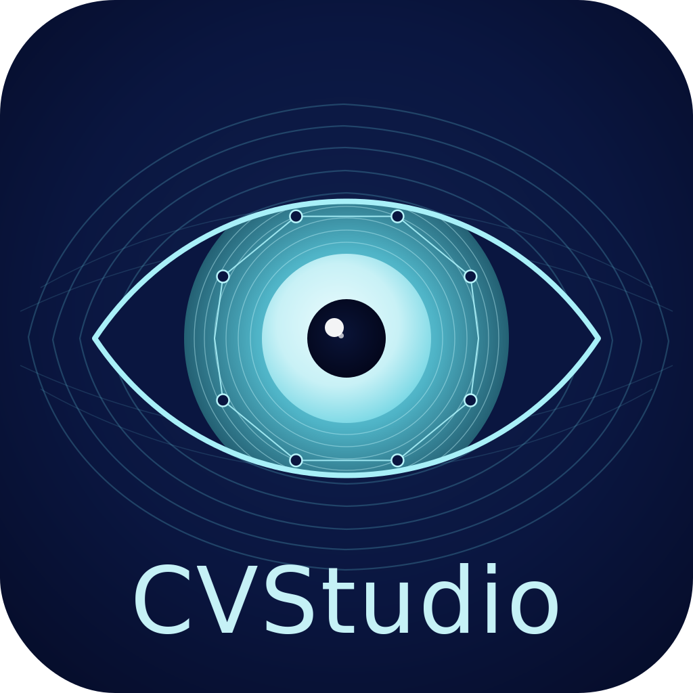

<div align="center">



# CVStudio

**An interactive OpenCV + AI playground. Chain image operations, tune every parameter with live preview, ask a VLM what's in the frame — and export the OpenCV side as ready-to-run Python.**

[](pyproject.toml)
[](https://doc.qt.io/qtforpython/)
[](https://opencv.org/)
[](LICENSE)
[](tests/)

</div>

---

## Overview

CVStudio is a desktop tool for **finding the right OpenCV pipeline by iterating on parameters in real time** — and, optionally, for **asking a vision model what your processed image contains**. Load an image, stack operations (Gaussian blur → adaptive threshold → morphology → find contours, ...), tweak every parameter with auto-generated sliders, then export the OpenCV side as a self-contained Python function whose output matches the live preview byte-for-byte.

Built for engineers who currently iterate on `cv2.GaussianBlur(img, (5, 5), 0)` calls in Jupyter cells, one parameter at a time — and who'd like an LLM-grade second opinion on the result without leaving the editor.

## Highlights

### Pipeline editor
- **Live preview** with a 120 ms debounced worker thread — no UI freezes on large images.
- **62 built-in operations** across 14 categories: filtering, threshold, morphology, edge, color, geometric, analysis, composite, arithmetic, features, frequency, segmentation, stereo, plus **AI** (see below).
- **Auto-generated UI** — every slider, spinner, text field, and dropdown is derived from a declarative `Parameter` spec. Adding an operation does not touch UI code.
- **Pipeline persistence** — save and load pipelines as `.cvpipe.json`.
- **Code export** — emit a stand-alone `process(img)` Python function whose output is verified equal to the live OpenCV pipeline. (AI nodes export as clearly-commented pass-throughs — they can't be reproduced without the model installed on the target machine.)
- **Node-graph pipeline view** — the bottom strip renders the pipeline as a horizontal chain of nodes with bezier connectors. Drag a node sideways to reorder; click the green chip to enable/disable; click the X chip to remove.
- **DAG core** — wire any node's output port into any compatible input port (multi-input ops like Blend / Apply Mask / Difference). Cycles, duplicate connections, and unknown ports are silently rejected.

### Image surfaces
- **Before / after compare** (`Ctrl+B`) — toggle a side-by-side view to see exactly what the pipeline does.
- **Zoom & pan** — cursor-anchored mouse-wheel zoom, drag-to-pan, double-click to refit.
- **Histogram panel** — per-channel intensity overlay refreshes with every preview.
- **Per-operation timing** — each pipeline row shows how long that step took on the last preview run.
- **High-bit-depth inputs** — 16-bit and floating-point TIFFs / PNGs load through a normalising reader; their dynamic range is rescaled to uint8 instead of clipped.
- **Fast preview on huge images** — sources larger than 1600 px on their longest side are auto-downscaled for the live preview only; code export and Save Image stay full-resolution.
- **Region of interest (ROI)** — draw a rectangle on the image (`Ctrl+R`) and the pipeline runs only inside that region; drag inside the rectangle to drop the processed crop somewhere else. Exported code reproduces the same crop / paste-back behaviour.
- **2D / 3D visualization** — left-side activity bar switches the central view to a heatmap, surface plot, or point cloud (pyqtgraph) so a processed depth map / intensity image can be inspected as a colour map or 3-D mesh.

### Sources
- **Open Image** — PNG / JPG / BMP / TIFF / WebP, including 16-bit and float.
- **Open Camera / Open Video** — streams frames through the live pipeline. A `VideoFeedController` drives a QTimer at source FPS and gates each frame on the worker being free, so heavy pipelines just slow the displayed framerate instead of queueing. **Pause / Resume** (`Space` shortcut) freezes the feed on the current frame without releasing the source.
- **Open Dataset** (`Ctrl+D`) — non-modal grid of thumbnails for every image in a folder; clicking a thumbnail loads it as the live source.

### Outputs
- **Save Processed Image…** runs the full-res pipeline and writes the result to disk.
- **Record Video…** (active during camera / video capture) streams each processed frame into a VideoWriter.
- **Bulk Export Dataset…** applies the current pipeline to every image in a folder on a background thread; progress, per-file errors, and cancellation surface in the dialog.

### AI suite (optional)
Four backends sharing a unified Run / cancel / cache / response-panel flow:

| Op                              | Backend                | What it produces                                       |
| ------------------------------- | ---------------------- | ------------------------------------------------------ |
| **VLM Q&A**                     | Local **Ollama**       | Streaming free-form reply to a user prompt             |
| **CLIP Zero-shot Classify**     | HF `openai/clip-vit-…` | Top-K scored labels for a user-supplied label list     |
| **OWL-ViT Zero-shot Detection** | HF `google/owlvit-…`   | Colored bounding boxes for free-form text prompts      |
| **BLIP-2 Caption**              | HF `Salesforce/blip2-…`| Free-form caption (no prompt required)                 |

All four ops:
- Land their **text response in a side panel** (right of the image) so downstream OpenCV ops keep operating on the original pixels. OWL-ViT additionally draws boxes on the image — that's the only AI op that touches the canvas.
- Are **manual-trigger** — a ▶ Run button in the parameter panel authorizes the next inference, so typing in the prompt field does not fire a query on every keystroke.
- Stream / track partial state with a `Thinking…` placeholder, then live tokens (VLM) or final result.
- **Auto-cancel** older in-flight work when you edit prompts / labels / model on the same node — siblings on other nodes keep running.
- Cache results per `(image, op-params)` and **persist the cache to disk** between launches.
- Surface a uniform **Auto-run** toggle: when ON, every frame of a video source triggers a fresh inference (auto-cancel keeps the queue bounded if the model is slower than the source's framerate).

### Activity bar
Left-rail mode switcher: **Op** / **2D** / **3D** / **AI**. Op shows the full operation catalog; AI filters the catalog to only AI ops so you don't hunt for the model nodes. 2D and 3D swap the central view for heatmap / surface / point-cloud visualizations of the current pipeline output. `Ctrl+1` / `Ctrl+2` / `Ctrl+3` shortcuts.

### Conveniences
- **In-app Operation Guide** — `Help → Operation Guide…` (or `F1`) opens a non-modal window with rich documentation for **the whole app**: an "App features" section explains every menu item, panel, and concept, and an "Operations" section documents every op (what it does, what each parameter means, where it shines, common pairings).
- **Tools → Clear AI cache** wipes every cached VLM / CLIP / OWL-ViT / BLIP-2 response and forces a fresh inference on the next pipeline pass.
- **QSettings-backed UI state** — window geometry, splitter sizes, downscale toggle, and the active activity-bar mode persist between launches.

## Quick start

```bash
git clone https://github.com/OmerKuruDs/CVStudio.git
cd CVStudio
python -m venv .venv
.venv\Scripts\activate              # Windows PowerShell
# source .venv/bin/activate         # Linux / macOS
pip install -e ".[dev]"
pytest                              # 472 tests, all passing
cvstudio                            # launch the GUI
```

### Optional: AI extras

The AI suite needs the (heavy) HuggingFace stack and is opt-in:

```bash
pip install -e ".[ai]"              # transformers, torch, pillow (~5 GB on disk)
```

For the Ollama-based VLM Q&A op you also need Ollama running locally with at least one VLM pulled:

```bash
ollama pull llava                   # ~5 GB; or `bakllava`, `llava:13b`, …
ollama serve                        # daemon — listens on http://localhost:11434
```

The CLIP, OWL-ViT, and BLIP-2 ops use HuggingFace directly and download the chosen checkpoint on first run (~600 MB for CLIP, ~1.5 GB for OWL-ViT, ~7 GB for BLIP-2).

If the `[ai]` extras aren't installed, the AI ops still appear in the catalog but render a friendly "install" message in the response panel instead of crashing.

### CLI

```bash
cvstudio --list                     # registered operation catalog, no UI
cvstudio --version
```

## Architecture

```
src/cvstudio/
├── core/                  # Domain primitives
│   ├── operation.py       # OperationSpec + Parameter dataclasses
│   ├── pipeline.py        # Pipeline (facade over Graph) + Roi
│   ├── graph.py           # DAG model + topological execution + port types
│   ├── registry.py        # Global operation registry
│   ├── codegen.py         # Pipeline → Python source generation
│   ├── serialization.py   # Load / save pipelines as JSON (v1 → v2 migration)
│   ├── video.py           # VideoSource — thin wrapper over cv2.VideoCapture
│   ├── batch.py           # Folder-level pipeline application with cancellation
│   ├── image_io.py        # Robust read_image() that normalises 16-bit / float inputs
│   └── op_docs.py         # In-app help: feature topics + per-op documentation
├── operations/            # Built-in operations (one module per category)
│   └── ai.py              # VLM Q&A, CLIP, OWL-ViT, BLIP-2 — all built on backend.AIBackend
├── ai/                    # AI infrastructure (lazy imports — no torch unless [ai] installed)
│   ├── backend.py         # AIBackend / StreamingAIBackend: shared cache + auth + spawn
│   ├── streaming.py       # Cross-thread bus + partial store + node display + cancellation
│   ├── cache_storage.py   # JSON persistence to QStandardPaths
│   ├── ollama_client.py   # urllib-based Ollama HTTP (stream=true line-JSON)
│   ├── hf_clip.py         # CLIP backend (lazy torch import + model cache)
│   ├── hf_owlvit.py       # OWL-ViT backend + Detection dataclass
│   └── hf_blip2.py        # BLIP-2 captioning backend
├── resources/             # Bundled assets (icon, theme QSS, arrow glyphs)
└── ui/                    # PySide6 widgets
    ├── app.py             # QApplication bootstrap (org + app names → QSettings + cache dir)
    ├── main_window.py     # Window assembly + menus + cache load/save + QSettings round-trip
    ├── activity_bar.py    # Left-rail mode selector: Op / 2D / 3D / AI
    ├── operation_catalog.py
    ├── parameter_panel.py # Form + ▶ Run button + AI Response panel
    ├── parameter_widgets.py
    ├── image_view.py
    ├── image_action_bar.py
    ├── image_tools_panel.py
    ├── histogram_panel.py
    ├── node_graph_view.py
    ├── viz_pages.py       # 2D / 3D activity-bar pages
    ├── visualization_panel.py  # Heatmap / surface / point-cloud widgets
    ├── dataset_page.py    # Open Dataset thumbnail grid
    ├── batch_dialog.py
    ├── code_export_dialog.py
    ├── help_dialog.py
    ├── video_feed_controller.py  # Frame pump with pause / resume + auto-cancel hooks
    └── pipeline_worker.py  # Background thread for preview
```

Each operation is a small declarative `OperationSpec`: an id, a parameter list, a pure `(image, **params) -> image` function, and a `code_export` callable that emits matching Python. AI ops set `manual_trigger=True` so the parameter panel shows a ▶ Run button and the inference doesn't fire until you press it.

The AI suite specifically follows one shape — `AIBackend` in `ai/backend.py` owns the cache, the Run-authorization gate, the background-thread spawn, the cancel-on-param-change logic, and the "publish status to the right-side panel" wiring. Each concrete backend supplies only `validate(params)`, `make_key(image, params)`, `run(key, image, params, node_id)`, and `format_display(result)` (plus optional `render(image, result, params)` for ops like OWL-ViT that draw on the canvas).

## Built-in operations

| Category     | Operations                                                              |
| ------------ | ----------------------------------------------------------------------- |
| Filtering    | Gaussian Blur, Median Blur, Bilateral Filter, NL-Means Denoise, Unsharp Mask, Custom Kernel |
| Threshold    | Binary, Otsu, Adaptive, Triangle, In-Range (BGR)                        |
| Morphology   | Erode, Dilate, Open, Close, Gradient, Top-Hat, Black-Hat                |
| Edge         | Canny, Sobel, Laplacian, Scharr                                         |
| Color        | To Grayscale, To HSV, Invert, Extract Channel, CLAHE, HSV In-Range Mask |
| Geometric    | Resize, Rotate, Flip                                                    |
| Arithmetic   | Add, Subtract, Multiply, Bitwise AND, Bitwise OR, Bitwise XOR           |
| Frequency    | FFT Magnitude, FFT Phase, Low-Pass Filter, High-Pass Filter, Band-Pass Filter |
| Features     | Harris Corners, Shi-Tomasi Corners, FAST Keypoints, ORB Keypoints, Hough Lines, Hough Circles |
| Segmentation | Distance Transform, Connected Components, Watershed, GrabCut (rect)     |
| Composite    | Blend, Apply Mask, Difference (multi-input — wire the second input by dragging from any node's output port) |
| Stereo       | Stereo BM (disparity), Stereo SGBM (disparity)                          |
| Analysis     | Find Contours                                                           |
| **AI**       | **VLM Q&A (Ollama)**, **CLIP Zero-shot Classify**, **OWL-ViT Zero-shot Detection**, **BLIP-2 Caption** |

## Adding a new operation

See [CONTRIBUTING.md](CONTRIBUTING.md#adding-a-new-operation) for the full recipe. Short version:

1. Add a function plus `OperationSpec` in `src/cvstudio/operations/<category>.py`.
2. Register the module in `src/cvstudio/operations/__init__.py`.
3. Add a test in `tests/operations/`.
4. Add a help entry in `src/cvstudio/core/op_docs.py` (`OP_DOCS["<id>"]`).

The catalog, parameter panel, and code exporter all pick up the new spec automatically.

To add a new **AI** op: subclass `AIBackend` (or `StreamingAIBackend` for token streams) in `src/cvstudio/operations/ai.py` and supply the four hook methods — the cache + auth + cancel + display-panel plumbing is inherited for free.

## Roadmap

**v0.1 — Core scaffold.** Registry, pipeline, serialization, CI. *Done.*

**v0.2 — Interactive MVP**
- [x] PySide6 main window with image view, pipeline list, and parameter panel
- [x] Auto-generated sliders / inputs from parameter spec
- [x] Debounced preview with a worker thread
- [x] Zoom and pan in the image view
- [x] Downscaling preview mode for very large images

**v0.3 — Power user**
- [x] Pipeline save / load (`.cvpipe.json`)
- [x] Code export to stand-alone Python
- [x] Histogram panel
- [x] Before / after split view
- [x] Per-operation timing HUD
- [x] Drag-and-drop pipeline reordering

**v1.0 — Editor maturity**
- [x] ROI selection with crop / paste-back
- [x] Node-graph pipeline view
- [x] DAG core + DAG UI + explicit Source node + free node positioning + DAG codegen
- [x] Video / camera input with frame-pump controller + pause / resume
- [x] Batch processing dialog
- [x] Dataset gallery
- [x] 2D / 3D visualization pages (heatmap / surface / point cloud)
- [x] Activity bar (Op / 2D / 3D / AI mode switcher)

**v1.1 — AI integration**
- [x] Streaming Ollama VLM Q&A with auto-cancellation
- [x] CLIP zero-shot classification
- [x] OWL-ViT zero-shot detection with on-image boxes
- [x] BLIP-2 captioning
- [x] Right-side AI Response panel (text outputs no longer overlay the image)
- [x] ▶ Run button — manual-trigger authorization per AI node
- [x] AIBackend base class — shared cache + auth + spawn + render scaffolding
- [x] AI cache persistence (`ai_cache.json` under QStandardPaths AppData)
- [x] `auto_run` parameter for frame-by-frame AI on video sources
- [x] QSettings — window geometry, splitter sizes, downscale toggle, activity mode persist

**Future**
- [ ] Packaging — Windows installer / macOS .app / Linux AppImage so the app ships beyond `pip install -e .`
- [ ] Internationalization — extract user-facing strings through `tr()`
- [ ] Additional AI backends (SAM segmentation, Depth-Anything monocular depth, …)
- [ ] AI ops in `Bulk Export Dataset` for offline batch labelling

## License

Apache-2.0 — see [LICENSE](LICENSE).
